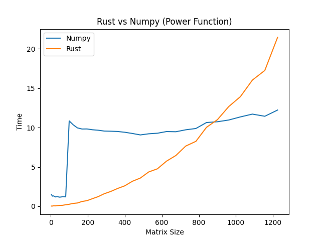
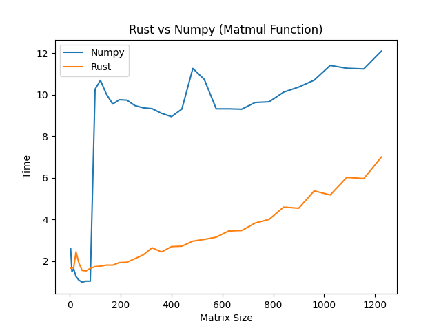
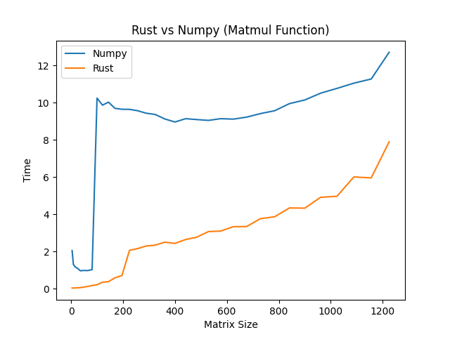
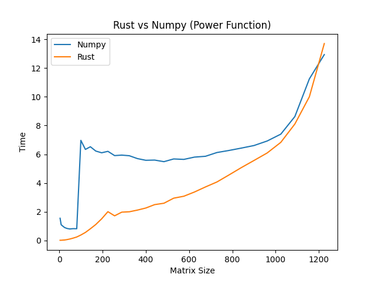
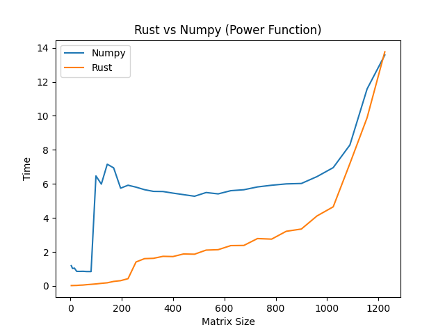

# RustyLab1

> We do what we must, because we can\
<cite> GLaDOS, Portal 


What started as a quest for a "Faster than NumPy" answer to Lab one, ended up being a very long growing project into implementing a BLAS  and threading to try to keep up with NumPy's C based backend  
Ultimately the goal was to do lab one, in C++ or Rust, as C++ is what this lab has historically done in, and show the performance improvement from Python.  

## The Issue
With small matrices, Python's overheads are large enough to make a Rust based solution faster without any magic tricks  
However, after approaching ~700 * 700 matrices, on my AMD 5800H, NumPy became faster again, a lot faster  

### The fix*
Rust's ndarray supports using a BLAS, something that before this project, Was something I didn't really know existed.  
One new issue, was finding a way to link said BLAS, as ndarray-linalg already attempts to do this, but doesn't make it usable by ndarray itself by default  
It turns out, if you don't specify which BLAS for ndarray-linalg to use, it just works. 

But NumPy was still faster after 900 * 900 matrices...

### A Level playing field
NumPy's performance as seen in the figure above, is odd, it doesn't seem to follow big O notation like the Rust version does. It was also fast, so trying to figure out what it was doing, wasn't trivial. What would happen however, is my computer's fans would speed up, whenever the benchmark switched from NumPy, to Rust.

Effectively, NumPy would use multithreading, even if it was harming performance, for matrices above approximately 128 * 128 in size  
NumPy's threading overhead however is significant, and greatly slows down the program, often spending more time setting up than the amount of time it would have taken for one core to do the entire task.  

Enabling multithreading for the rust version makes the code far less readable
```rust
use ndarray::prelude::*;

fn matmul_demo(array_a: Array2, vector_x: &mut Array1) {
    vector_x = array_a.dot(&vector_x);
}
```

Became
```rust
use ndarray::prelude::*;
use ndarray::parallel::prelude::*;

fn par_mat_vec_mul(array_a: &ArrayView<f64, Ix2>, vector_x: &Array<f64, Ix1>) -> Array<f64, Ix1> {
    let mut vector_b = Array::zeros(vector_x.len());
    let a_iter = array_a.axis_chunks_iter(Axis(0), 32);
    let b_iter = vector_b.axis_chunks_iter_mut(Axis(0), 32);
    let zipped = a_iter.into_par_iter().zip(b_iter);

    zipped.for_each(|mut x| x.1.assign(&x.0.dot(vector_x)));

    return vector_b;
}
```

As we now need to:
 * Allocate memory to the output array in advance, we can't reuse the old vector
 * Split the matrix A up so that we can do matrix multiplication by parts
 * Split the output vector up in the same way, so we can assign the part solution to the correct part of the output vector, accounting for Rust's ownership and borrowing rules
 * Make the iterator into a parallel one, based on the Rayon package
 * Assign the part solution to the correct ArrayView of the output vector

None of this should be necessary however, as Intel MKL should be using the OpenMP version by default, though I suspect the Python GIL maybe causing issues  
However, this ultimately paid off with these results:


Whilst the threading overheads are far smaller than Python/NumPy's they are still significant for small matrices, so the single threaded version is used for matrices smaller than 300*300

<cite> Old benchmark with the multithreading cut off much lower

### OpenBLAS, 2600X testing, and the limit.
One issue with Intel MKL is it has a more restrictive licence than OpenBLAS, and is artificially limited in performance when used by a non Intel CPU.  
Implimenting OpenBLAS on windows however wasn't trivial, it required using Rustflags to compile, and Vcpkg to pre-install and compile OpenBLAS before hand.  
The following tests were also done on a 2600X testing to better show the "Limit" of both MKL, OpenBLAS, and NumPy

<cite> OpenBLAS version

<cite> Intel MKL version

It turns out, even with the artificial speed limit, MKL is still faster and easier to use than MKL  
All three methods however run into issues when I assume I run out of CPU cache, but I am unsure how to test this theory. The 2600X should on paper, be able to hold upto a ~1400 * 1400 Matrix in L3 Cache, so this spike at at around 1100 * 1100 matrices makes sense, assuming that the difference is being used by Python or Windows.

## Installing
### Generic instructions
First install [rustup][0]

Then, in your Conda/Python venv, install [Maturin][1]  
```pip install maturin```

Finally, cd into `.\RustyLab1\` before doing one of the following:

### 1. Intel MKL version (Faster, easier, x86 only, more restrictive licence)

The `Cargo.toml` file is already configures correctly for this option.  
Run:   
```maturin develop --release```  
RustyLab1 is now installed and can be called from python  
```py
import numpy as np
import RustyLab1

A = np.array([[2., -1.], [-1., 2.]])
tol = 1e-6

print(RustyLab1.power(A, tol))
```
### 2. OpenBLAS for Windows
1. Set up [Vcpkg][3]  
2. As per the instructions [here][4], install the `x64-windows-static` triplet
   * If not using windows, you *should* be able to skip to 5., but this isn't tested 
3. In `Cargo.toml` uncomment:
   * `blas-src = {version = "0.9.0", features = ["openblas"]}`
   * `openblas-src = { version = "0.10", features = ["cblas", "system"] }`
4. In `Cargo.toml` comment out:
   * `blas-src = {version = "0.9.0", features = ["intel-mkl"]}`
5. Run: ```maturin develop --release```

RustyLab1 is now installed and can be called from python


[0]: https://www.rust-lang.org/tools/install
[1]: https://github.com/PyO3/maturin
[3]: https://vcpkg.io/en/getting-started
[4]: https://github.com/blas-lapack-rs/openblas-src
